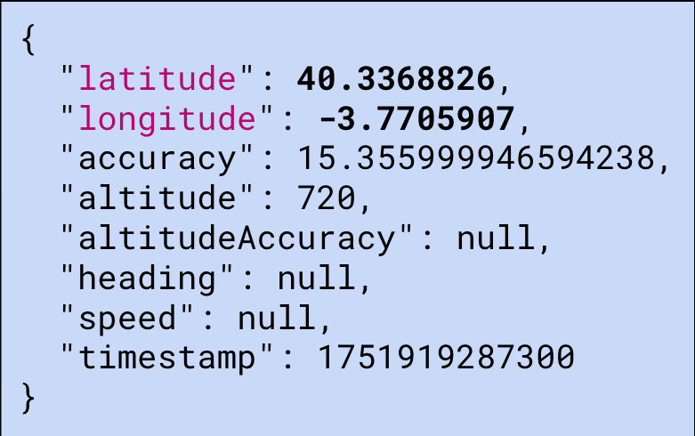

# Tracking Without Borders: Studying the Role of WebViews in Bridging Mobile and Web Tracking

## Authors

- Nipuna Weerasekara (IMDEA Networks Institute / Universidad Carlos III de Madrid)
- José Miguel Moreno (Universidad Carlos III de Madrid)
- Srdjan Matic (IMDEA Software Institute)
- Joel Reardon (University of Calgary / AppCensus)
- Juan Tapiador (Universidad Carlos III de Madrid)
- Narseo Vallina-Rodriguez (IMDEA Networks Institute / AppCensus)

> Artifacts Release Notes

## Proofs-of-Concept

### Canvas Fingerprinting

`/PoCs/com.niweera.canvasfingerprinter.apk`

This is a proof-of-concept Android app that implements a canvas fingerprinting technique. 
It is used to demonstrate how canvas fingerprinting on WebViews can be exploited for tracking purposes.

### Permission Piggybacking

- `/PoCs/com.niweera.permissionpoc.v1.apk`

- `/PoCs/com.niweera.webchromeclientpoc.apk`

This is a proof-of-concept Android app that implements permission piggybacking techniques 
to demonstrate how JavaScript code loaded in a WebViews can be used to access sensitive 
permissions (such as geolocation, or media devices) 
without the user's explicit consent.

## Datasets

### Apps Used in the Study

`/Main-Dataset/apks.csv`

This CSV file contains the following columns:

| Column           | Description                     |
|------------------|---------------------------------|
| **app_id**       | Application package name        |
| **category**     | Application category            |
| **md5hash**      | MD5 hash of the `base.apk` file |
| **app_name**     | Name of the application         |
| **version_name** | Version name of the application |
| **version_code** | Version code of the application |

The CSV file contains 13,045 applications across 35 categories.

### WebView Classes from the Apps

`/Main-Dataset/webviews.csv`

This CSV file contains the following columns:

| Column             | Description                                       |
|--------------------|---------------------------------------------------|
| **app_id**         | Application package name                          |
| **class_name**     | Package name of the WebView class                 |
| **is_first_party** | Whether the class is first-party or not (Boolean) |

### WebView Classes with SDKs

`/Main-Dataset/class_name_sdk_name_dataset.csv`

This CSV file contains the following columns:

| Column             | Description                                       |
|--------------------|---------------------------------------------------|
| **class_name**     | Package name of the WebView class                 |
| **sdk_name**       | Name of the SDK associated with the WebView class |

- apps, sdks dataset (app_id, sdk_name)

### Apps with SDKs (that implement WebViews)

`/Main-Dataset/apps_sdk_names_dataset.csv`

This CSV file contains the following columns:

| Column             | Description                                       |
|--------------------|---------------------------------------------------|
| **app_id**         | Application package name                          |
| **sdk_name**       | Name of the SDK associated with the WebView class |

## Scripts

### Python script to decompile the APKs and extract WebView classes

`/Scripts/WebViewChecker.py`

### Python script to identify apps that use GeckoView

`/Scripts/GeckoViewChecker.py`

### Python script to extract the permissions requested in the apps

`/Scripts/PermissionExtractor.py`

### Python script to identify WebView classes that implement WebChromeClient for Geolocation and Web Permissions

`/Scripts/WebViewPermissionChecker.py`

# Funding Support

